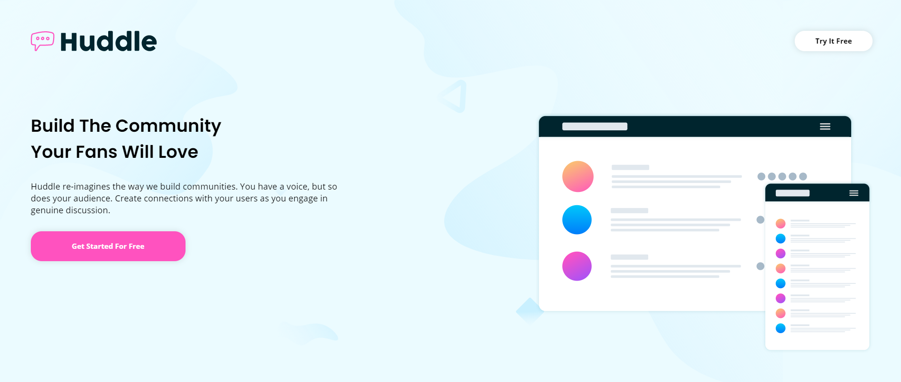

# Huddle landing page with alternating feature blocks

## ℹ About

Depevolep using Frontend Mentor to improve my front-end skills.

You can find this challenge on their website, where you can see the style-guide.md and images to help you.

## 🖥 Desktop

## 📱 Mobile

## 🛠 Deploy

This Website was deployed using Vercel, on this [link](https://huddle-landing-page-with-alternating-feature-blocks-zeta.vercel.app).

## 📄 License

This repository is being hosted under the MIT License.
